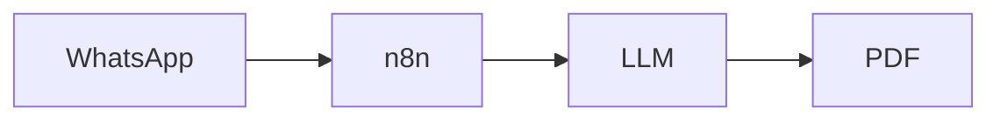

# Worker-Employer Platform: Stateless → Stateful Migration
**Context**: A platform helping immigrants enter the German job market via WhatsApp/Facebook bots.
**Challenge**: Moving from anonymous submissions to user accounts while ensuring GDPR compliance.

## Key Problems

* No User Context: Agents don’t know who they’re serving (e.g., no history, no identity).
* PII Risks: Raw WhatsApp/Facebook messages (containing names, emails, addresses) are fed directly to the LLM.
* Permission Gaps: No Role-Based Access Control (RBAC) for employers/users.
* Missing Datenschutzerklärung: No privacy policy to inform users about data usage (flagged by the community).

## Proposed Solutions

|**Problem**|**Solution**|**Status**|
|-----------|------------|----------|
|Stateless submissions|MigrationTable + UserContext|Draft Design|
|PII in LLM|Pre-processing with spaCy/NER|Prototype Needed|
|Permission Model|Supabase RBAC|Researching|
|Datenschutzerklärung|Privacy policy page + consent logs|TODO: High Priority|

## Current Architecture

- **Stateless → Stateful Migration**:
  - Current flow: `WhatsApp/Facebook Bot → n8n → LLM → CV PDF`.
  - **Problems**: 
    - No user accounts means **no context** for agents (e.g., "Who is this user? What’s their history?").
    - Duplicate users: Same person might submit via WhatsApp and Facebook.
  - **Solution Sketched**:
    - `MigrationTable` to link anonymous submissions → registered users.
        - Email hashing (GDPR-friendly).
        - Temporary IDs (for unregistered users).
    - `UserContext` object to pass identity/permissions to agents
  - **Open Question**: 
    - *How to handle duplicate users?* (e.g., same person submits via WhatsApp + Facebook).

- **GDPR in LLM Pipelines**:
  - **Risk**: Raw WhatsApp messages (with PII) fed directly to the LLM.
  - **Proposed Fixes**:
    - **Pre-LLM filtering**: Use spaCy/NER to redact names/emails.
    - **Consent Logs**: Track user approval for data usage (required for EU compliance).
  - **Consent Logs**:
    - Track user approval for data usage (required for EU compliance).
    - Store in a ConsentLogs table
  - **Datenschutzerklärung (Privacy Policy)**:
    - TODO: Draft a GDPR-compliant privacy policy (use templates from iubenda).
    - Key Sections to Include:
        - What data is collected (e.g., WhatsApp messages, emails).
        - How it’s used (e.g., CV generation).
        - User rights (e.g., access, deletion, correction).
        - Data retention period.
    - Where to Host: Link in the app footer + registration flow.

- **Permission Models**:
  - **Challenge**: Employers need to view CVs, but **who controls edits?**
  - **Draft Design**:
    - `RBAC` (Role-Based Access Control) with 2 roles:
      - `User`: Edit own CV.
      - `Employer`: View applications (no edits).
      - `Admin`: Manage users/CVs.
    -**Tool**: supabase

