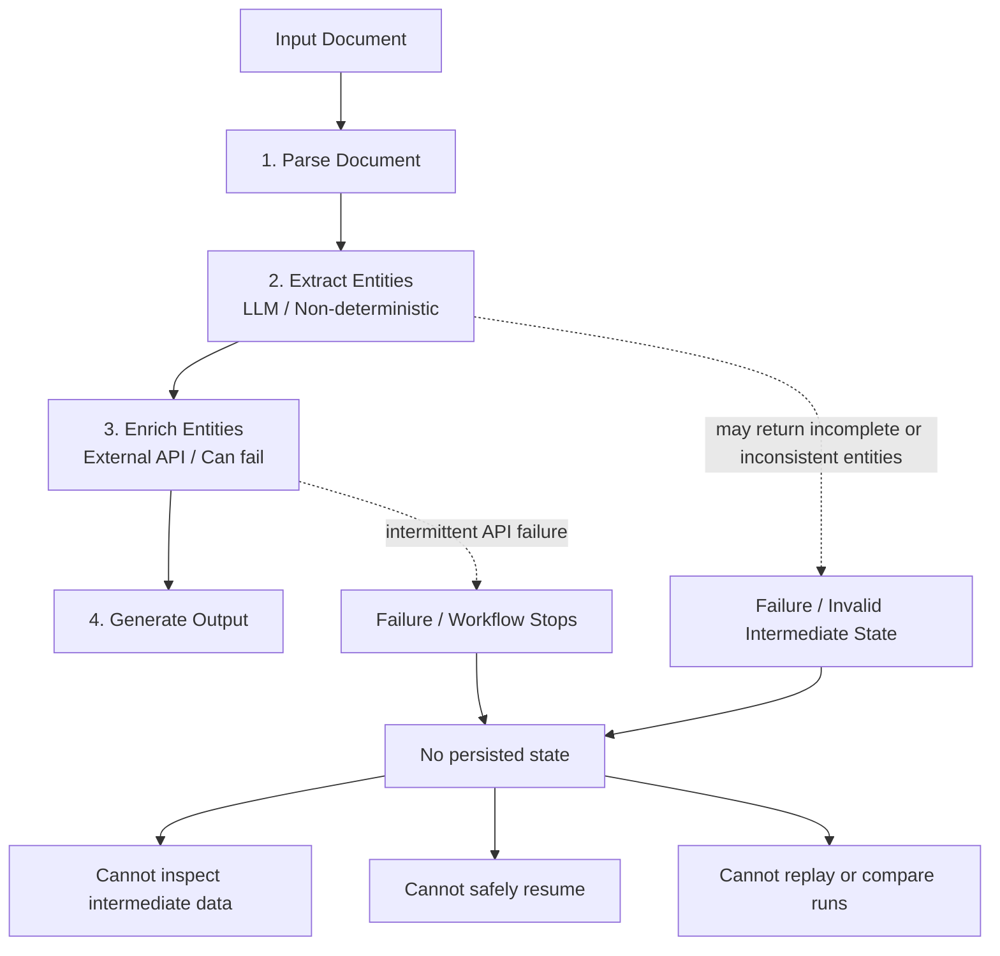
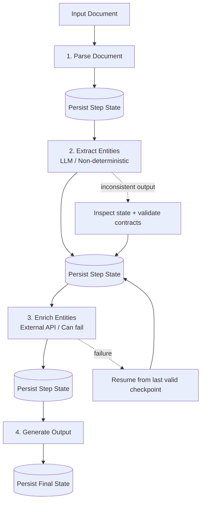

# Challenge: Make This Workflow Resumable and Debuggable

## 🧾 Scenario

You are building an AI-powered document processing pipeline:

1. Parse incoming document
2. Extract structured information (LLM)
3. Enrich data via external API
4. Generate final output

This system is already deployed.

## ⚠️ Problem

In production, the system frequently fails:

- LLM outputs vary across runs
- API calls fail intermittently
- workflows break mid-execution
- retries produce different results
- debugging is difficult

When something fails, you don’t know:

- what steps already completed
- what data was used at each step
- where the failure occurred
- how to resume safely

### 🔄 Current Workflow

## 🎯 Your Task

Design a **state layer** that makes this system:

- resumable after failure
- debuggable at every step
- reproducible across runs
- consistent across multi-step execution

### 🎯 Desired Design Goal

## 🧠 Design Questions

### 1. What state do you persist?

- full step outputs?
- minimal checkpoints?
- logs vs structured state?
- intermediate reasoning?

### 2. Where do you persist it?

- database?
- file system?
- event log?
- memory + fallback?

### 3. How do you resume execution?

- restart entire workflow?
- resume from last successful step?
- replay from a checkpoint?
- skip completed steps?

### 4. How do you debug the system?

- inspect state snapshots?
- trace execution history?
- compare multiple runs?

### 5. How do you handle failures?

- partial failures?
- inconsistent state?
- retries with non-deterministic steps?

### 6. What tradeoffs do you accept?

- storage vs simplicity
- consistency vs performance
- full replay vs incremental recovery

## 🔁 Extension (Advanced)

The workflow evolves over time:

- new steps are added
- schemas change
- logic is updated

👉 How do you handle **state versioning**?

## 📢 Output

Be ready to discuss:

- your design approach
- key decisions
- tradeoffs you accepted
- failure modes your system still has

---

## 💡 Reminder

This is not about writing code.

This is about designing **reliable AI systems**.
